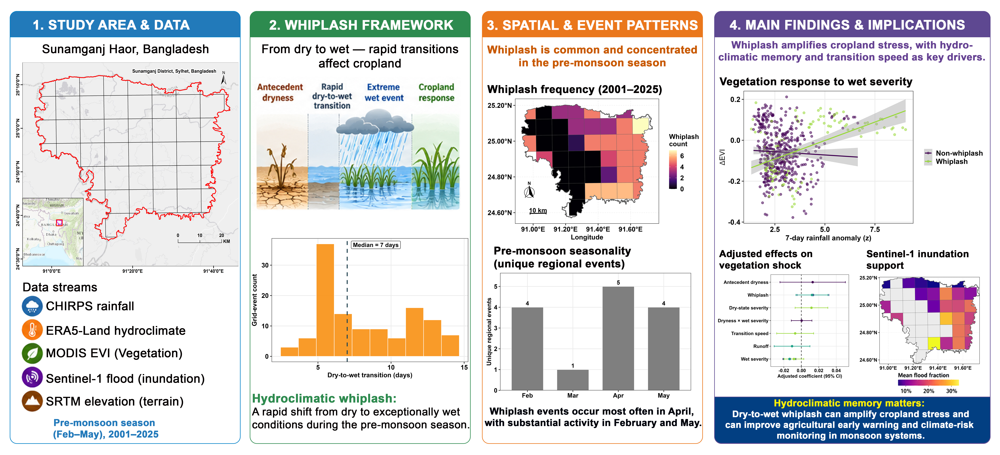

  

## Overview

Hydroclimatic whiplash refers to a rapid transition between contrasting hydroclimatic conditions, such as an anomalously dry period followed by an anomalously wet period. Although hydroclimatic whiplash has emerged as an important climate-risk concept, its independent effects on agricultural systems remain poorly understood, particularly in monsoon-dominated wetland environments.

This study investigates pre-monsoon dry-to-wet hydroclimatic whiplash and its relationship with cropland stress in the **Sunamganj haor region of Bangladesh**. The analysis integrates multi-source satellite and reanalysis datasets to evaluate whether antecedent dryness followed by extreme rainfall produces additional vegetation stress beyond the effects of wet-event severity and inundation.

## Abstract

Hydroclimatic whiplash, a rapid transition from anomalously dry to anomalously wet 
conditions, has emerged as a climate-risk concept, but its independent agricultural impact remains 
poorly tested in monsoon wetland systems. This study examined pre-monsoon dry-to-wet whiplash 
in Bangladesh’s Sunamganj haor region using CHIRPS precipitation, ERA5-Land hydroclimate, 
MODIS EVI and cropland support, Sentinel-1 inundation, and SRTM terrain data. We used a 1991
2020 climatological baseline to identify 2001–2025 extreme-wet events on a 10-km grid. The final 
panel comprised 590 unique grid-event observations, including 119 whiplash observations. Cross
classified mixed-effects models accounted for repeated regional events and grid cells, with additional 
continuous-memory, nonlinear, matching, two-way fixed-effects, leave-one-event-out, threshold
sensitivity, spatial, and Sentinel-1 analyses. Binary whiplash was not independently associated with a 
more negative EVI response (β = 0.0134, 95% CI -0.0048 to 0.0317, p = 0.148), and antecedent 
dryness, dryness × rainfall interaction, and transition speed were also non-significant. In contrast, 7
day rainfall anomaly was negatively associated with EVI change (β = -0.0131, p < 0.001). A 
matched analysis suggested a negative whiplash effect, but residual covariate imbalance and 
threshold sensitivity weakened causal interpretation. Sentinel-1 flooded-cropland fraction showed a 
strong negative association with EVI response (β = -0.234, p < 0.001; Spearman ρ = -0.522). Results 
indicate that realized wet severity and inundation were more consistent determinants of cropland 
stress than binary whiplash status, supporting impact-based warning systems that combine 
antecedent state, incoming rainfall, flood extent, and crop condition. 

## Study Area

The study focuses on the **Sunamganj haor region of northeastern Bangladesh**, a low-lying wetland system characterized by strong seasonal hydroclimatic variability and extensive dry-season agriculture.

The region is particularly vulnerable to pre-monsoon extreme rainfall and flash flooding, which can affect cropland during critical stages of crop development.

## Data Sources

The study integrates multiple satellite and reanalysis products:

* **CHIRPS** — precipitation and rainfall anomalies
* **ERA5-Land** — hydroclimatic and antecedent environmental conditions
* **MODIS EVI** — vegetation condition and cropland response
* **MODIS cropland support data** — identification and characterization of agricultural areas
* **Sentinel-1 SAR** — inundation and flooded-cropland assessment
* **SRTM** — terrain and elevation information

## Analytical Framework

The analysis was conducted on a **10-km spatial grid** and used the **1991–2020 climatological period** as the reference baseline.

Extreme-wet events occurring during **2001–2025** were identified and evaluated in relation to antecedent dry conditions and subsequent vegetation response.

The analytical framework included:

* Binary dry-to-wet whiplash classification
* Continuous antecedent hydroclimatic memory
* Rainfall anomaly assessment
* Dryness × rainfall interaction analysis
* Transition-speed analysis
* Cross-classified mixed-effects models
* Nonlinear model specifications
* Matched analyses
* Two-way fixed-effects models
* Leave-one-event-out sensitivity analysis
* Whiplash-threshold sensitivity analysis
* Spatial robustness assessment
* Sentinel-1 flooded-cropland analysis

## Key Findings

* The final dataset contained **590 unique grid-event observations**, of which **119 were classified as whiplash observations**.
* Binary whiplash status was **not independently associated with a significantly more negative EVI response**.
* Antecedent dryness, the dryness × rainfall interaction, and transition speed were also not statistically significant in the main models.
* Greater **7-day rainfall anomaly** was significantly associated with a more negative vegetation response.
* A matching-based analysis suggested a possible negative whiplash effect, although residual covariate imbalance and sensitivity to threshold definitions limited causal interpretation.
* The proportion of cropland inundated according to Sentinel-1 showed a strong negative relationship with EVI response.
* Overall, **wet-event severity and realized inundation were more consistently associated with cropland stress than binary dry-to-wet whiplash classification**.

## Implications

The findings suggest that agricultural early-warning systems in monsoon wetland environments may benefit from focusing on the **realized severity of rainfall and inundation**, rather than relying only on binary definitions of hydroclimatic whiplash.

An impact-based monitoring framework could integrate:

1. Antecedent hydroclimatic conditions
2. Incoming rainfall intensity and anomaly
3. Flood and inundation extent
4. Cropland exposure
5. Satellite-observed crop condition

Such an approach may provide a more direct representation of agricultural risk in highly flood-prone wetland systems such as the Bangladesh haor region.

## Keywords

**Hydroclimatic whiplash** · **Haor wetlands** · **Cropland EVI** · **Flash flood** · **Sentinel-1** · **Remote sensing** · **Bangladesh** · **Agricultural climate risk**
